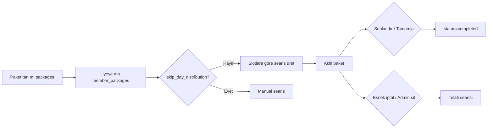

# Üye Paket Mantığı — Tek Kaynak (Admin + Üye)

Bu doküman, **admin** ve **üye** tarafındaki paket/seans mantığının tek düzende ilerlemesi için ana referanstır.  
Yeni özellik veya düzeltme yapılırken önce buradaki kurallara ve görev listesine bakılır.

**İlgili kural:** `.cursor/rules/member-package-logic.mdc`  
**İlişkili:** `AKTIF_BITMIS_PAKET_KARMASIKLIKLARI.md`, `docs/MOBILE-FIRST-TASKS.md`

---

## 1. Amaç

| Prensip | Açıklama |
|---------|----------|
| **Tek veri modeli** | `packages` → `member_packages` → `member_package_slots` → `sessions` |
| **Tek iş kuralı seti** | Sabit/esnek, iptal, telafi, aktif paket sayısı backend’de tanımlı |
| **Tek paket DTO şekli** | Admin ve üye aynı alan adları ve sayım mantığını görür |
| **Tek seans listesi düzeni** | Tarih/saat formatı, sütun sırası, sıralama ortak |
| **Rol farkı yalnızca yetki** | Üye: okuma + sınırlı iptal; Admin: CRUD + düzenleme + export |

---

## 2. Veri modeli

```
packages (şablon)
  ├── lesson_count, package_type: fixed | flexible
  └── weekly_lesson_count, month_overrun, ...

member_packages (üyeye atama)
  ├── member_id, package_id
  ├── start_date, end_date
  ├── status: active | completed | cancelled
  └── skip_day_distribution

member_package_slots (haftalık slot)
  └── day_of_week, start_time, staff_id  (member_package başına günde 1 slot)

sessions (gerçekleşen/planlanan seans)
  └── member_id, member_package_id, staff_id, room_id, start_ts, end_ts
```

**Kısıtlar**
- Üye başına **aynı anda en fazla 1 aktif** `member_packages` (`status = active`)
- Aktif paket varken yeni paket ancak mevcut paket **sonlandırıldıktan** sonra
- Seans sayısı `lesson_count`’u aşmamalı (telafi dahil)

---

## 3. Paket türleri ve iş kuralları

### Kullanım hakkı ve kalan seans

- Paket `lesson_count` = toplam **kullanım hakkı**
- Randevu günü **QR ile kapı girişi** (`checked_in_at`, `check_in_method=qr`) → hak düşer
- **QR okutmayan** üyeler: seans saati geldikten sonra **personel** geldi/gelmedi onayı verir (`check_in_method=manual` veya `attendance_outcome=no_show`)
- **Zamanında iptal** (esnek paket, seansa ≥ 2 saat kala) → hak **düşmez**; telafi randevusu eklenir
- **2 saat kala iptal edilmemiş** ve seans bitmiş, QR/onay yok → **otomatik no-show**, hak düşer
- Personel **mesai bitiminde** o gün onaylanmamış seans varsa **bildirim** alır
- **Kalan seans** = `lesson_count − tüketilen` (gelecek randevu sayısı değil)

### Sabit paket (`fixed`)
- Üye **seans iptal edemez**
- Admin seans silebilir; silince telafi seansı eklenir (`addNextSessionAfterLastForPackage`)

### Esnek paket (`flexible`)
- Üye iptal edebilir **yalnızca**:
  - Aktif pakete ait seans
  - Bugün ve sonrası (`start_ts >= bugün 00:00`)
  - Seansa **≥ 2 saat** var
- İptal sonrası paket sonuna **telafi seansı** eklenir; daha önce iptal edilmiş `start_ts` slotları tekrar eklenmez
- Aynı `member_id` + `start_ts` mükerrer aktif kayıtlar varsa **hepsi** iptal edilir

### Üye iptal uygunluğu — backend esas (MP-12)

Kaynak: `backend/utils/memberPackageDto.js` → `sessionToDto` → `canCancel`, `cancelReason`, `statusLabel`  
Frontend: `memberCanCancelSession(session)` yalnızca DTO’daki `canCancel` alanını okur (takvim + portal); yerel kural tekrarı yok.

| Koşul | `canCancel` | `cancelReason` / durum |
|-------|-------------|-------------------------|
| Seans zaten iptal (`deleted_at`) | false | İptal edildi / Paket iptal edildi |
| Paket aktif değil, seans tüketilmemiş | false | Paket iptal edildi |
| Seans tüketilmiş (QR, no-show, otomatik) | false | Katılındı / Gelmedi / Yapıldı |
| Geçmiş gün seansı (`start_ts` < bugün 00:00) | false | Geçmiş seanslar iptal edilemez |
| Sabit paket | false | Sabit pakette seans iptali yapılamaz |
| Esnek, seansa < 2 saat | false | İptal süreniz dolmuştur |
| Esnek, bugün/ileri, ≥ 2 saat, aktif paket | **true** | Planlandı |
| Admin API (`forAdmin: true`) | false | — |

### Telafi seansı (`backend/utils/packageSessions.js`)
- Arama **iptal edilen seansın ertesi gününden** başlar (`afterCancelTs`); son aktif seans daha eskiyse yine iptal tarihi esas alınır
- Daha önce iptal edilmiş tüm `start_ts` değerleri atlanır (zincir iptal: 19.10 iptal → 23.10 telafi; 23.10 iptal → 26.10 telafi, 19.10’a dönülmez)
- Paket `end_date` ve `member_package_slots` içinde kalmalı
- Oda/personel çakışması varsa sonraki slot denenir
- `lesson_count` doluysa eklenmez (`package_full`)

### Paket aktif / bitmiş tanımı (MP-04)

| Durum | Kural |
|-------|--------|
| **Bitmiş** | `status` = `completed` veya `cancelled` **veya** `endDate <= bugün` (yerel YYYY-MM-DD) |
| **Aktif** | `status` = `active` **ve** bitmiş sayılmıyor |

Kaynak: `backend/utils/memberPackageStatus.js` (backend), `app.js` içinde `isMemberPackageActive` / `isMemberPackageExpired` (frontend).

---
- Aktif pakette kalan **kullanım hakkı** **< 4** ise uyarı (`member-portal` dashboard)

---

## 4. Paket yaşam döngüsü (ortak)



| Adım | Admin | Üye |
|------|-------|-----|
| Paket tanımla | `packages` CRUD | — |
| Üyeye ata | `openMemberPackageModal` → API POST | — |
| Slot / tarih düzenle | API PUT + effective_date | — |
| Sonlandır | `endMemberPackage` | — |
| Aktif paket gör | Üye kartı + paket geçmişi | Sidebar kart |
| Bitmiş paket gör | Paket geçmişi → Seanslar | Bitmiş paketler listesi |
| Seans listesi | `openPackageSessionsModal` | `openMemberPortalSessionsModal` |
| Seans iptal | Takvimden sil (admin) | Portal / takvim İptal |
| Export | Excel / PDF | — |

---

## 5. Ortak paket DTO (hedef şekil)

Admin ve üye API’leri aynı alanları döndürmeli:

```js
{
  id, packageId, packageName, packageType,  // fixed | flexible
  lessonCount, startDate, endDate, status,   // active | completed | cancelled
  remainingSessions,  // lesson_count − tüketilen hak (QR veya no-show)
  usedSessions,       // tüketilen hak sayısı
  scheduledFuture,    // gelecek planlı randevu (hak düşümü yapmaz)
  totalSessions,      // aktif (silinmemiş) randevu sayısı
  sessions: [          // start_ts ASC
    {
      id, staffId, staffName, roomId, roomName?,
      startTs, endTs, note?, checkedIn,
      isPast, isConsumed, canCancel, cancelReason, status  // scheduled | locked | completed | cancelled
    }
  ]
}
```

**Kaynak:** `backend/utils/memberPackageDto.js` (`sessionToDto`, `buildPackageWithSessions`) + `backend/utils/packageSessionCounts.js`

---

## 6. Ortak seans listesi UI düzeni

Tüm paket seans tabloları (admin modal, üye modal, export) aynı düzeni kullanır:

| Sütun | Format | Not |
|-------|--------|-----|
| # | 1, 2, 3… | `start_ts` sıralı |
| Tarih | `GG.AA.YYYY GünAdı` | örn. `08.06.2026 Pazartesi` |
| Saat | `H:mm` | örn. `8:00` (yalnızca başlangıç) |
| Personel | Ad soyad | |
| Oda | Oda adı | Yalnızca admin |
| Durum | Planlandı / Tamamlandı / İptal edilemez | Yalnızca üye |
| Not | Metin | Admin |
| İşlem | İptal / Düzenle | Role göre |

**Sıralama:** `start_ts` artan  
**Boş durum:** `Seans kaydı yok.`

### Paket özet kartı (MP-09 – MP-11)

| Öğe | Aktif paket | Bitmiş paket |
|-----|-------------|--------------|
| Başlık | Paket adı | Paket adı |
| Meta satır | `Esnek • 12.06.2026 – 20.06.2026` | Aynı + `• 5 seans` |
| Hak | `Kalan: 3 / 24` | — |
| Boş | `Aktif paket bulunmuyor.` | `Eski paket yok.` / `Bitmiş paket yok.` |

Frontend: `buildActivePackageSummaryHtml`, `fmtPastPackageSummaryMeta`, `MSG_NO_ACTIVE_PACKAGE` (`app.js`).

---

### Mevcut sapmalar (birleştirilecek)

| Konum | Sorun |
|-------|--------|
| ~~`renderPackageSessionsTable` (admin)~~ | MP-06 ile birleştirildi |
| ~~`renderMemberPortalSessionsTable` (üye)~~ | MP-06 ile birleştirildi |
| ~~Export Excel/PDF~~ | MP-07 `packageSessionsToExportRows` |
| Takvim liste görünümü | `fmtSessionListDate` / `fmtSessionListTime` — **hedef format** |

---

## 7. Dosya haritası

| Katman | Dosya | Sorumluluk |
|--------|-------|------------|
| Backend paket CRUD | `backend/routes/member-packages.js` | Ata, güncelle, sonlandır, seans üret |
| Backend üye portal | `backend/routes/member-portal.js` | Dashboard, iptal, `buildPackageWithSessions` |
| Backend telafi | `backend/utils/packageSessions.js` | `addNextSessionAfterLastForPackage`, `cancelPackageSessionsAtSlot` |
| Backend ortak DTO | `backend/utils/memberPackageDto.js` | `sessionToDto`, `buildPackageWithSessions` |
| Backend aktif/bitmiş | `backend/utils/memberPackageStatus.js` | `isMemberPackageActive`, `isMemberPackageExpired` |
| Backend hak sayımı | `backend/utils/packageSessionCounts.js` | Kalan hak, QR check-in, no-show |
| Backend admin sil | `backend/routes/sessions.js` DELETE | Sil + telafi |
| Frontend API | `api.js` | `memberPackageFromApi`, `getMemberPackageSessions`, `loadMemberPortalState` |
| Admin UI | `app.js` | `openMemberPackageModal`, `openPackageSessionsModal`, `renderPackageSessionsTable` |
| Üye UI | `app.js` | `renderMemberSidebar`, `openMemberPortalSessionsModal`, `memberCanCancelSession` |
| Format yardımcıları | `app.js` | `fmtCalendarHeaderDate`, `fmtSessionListDate`, `fmtSessionListTime` |

---

## 8. Tek görev listesi (MP-xx)

Bundan sonraki paket/seans işleri bu listeden takip edilir. Tamamlanınca `[x]` işaretleyin.

### A — Backend tekilleştirme

- [x] **MP-01** — `GET /member-packages/:id/sessions` cevabını `sessionToDto` ile üret (portal ile aynı mantık; admin için `forAdmin: true`, `canCancel: false`, `approvalLabel/Kind` ek alan)
- [x] **MP-02** — `buildPackageWithSessions` + `sessionToDto` paylaşılan modüle taşındı (`backend/utils/memberPackageDto.js`)
- [x] **MP-03** — Admin seans silme ve üye iptal: ortak `cancelPackageSessionsAtSlot` (mükerrer slot soft-delete + `afterCancelTs`/`skipStartTs` telafi); `resolveMemberPackageId` paylaşıldı
- [x] **MP-04** — “Üyeliği bitmiş” tanımı tekilleştirildi: `endDate <= today` veya `status = completed|cancelled`; admin listeler + üye portal aktif/geçmiş ayrımı

### B — Ortak format ve render

- [x] **MP-05** — `fmtPackageSessionDate(d)` ve `fmtPackageSessionTime(d)` tek fonksiyon; tüm tablolar bunu kullansın
- [x] **MP-06** — `renderPackageSessionsTable` + `renderMemberPortalSessionsTable` → tek `renderPackageSessionsTableRows(sessions, options)` 
  - `options.role`: `admin` | `member`
  - `options.isActive`, `options.onCancel`, `options.onRowClick`
- [x] **MP-07** — Export Excel/PDF ortak format fonksiyonunu kullansın
- [x] **MP-08** — Üye portal: Oda sütunu gösterilmez (admin’de kalır); API `room_name` admin/export için

### C — UI kart ve özet (admin = üye)

- [x] **MP-09** — Paket özet kartı ortak şablon: `buildActivePackageSummaryHtml` (ad, Esnek/Sabit, tarih aralığı, kalan/toplam)
- [x] **MP-10** — Admin paket geçmişi + üye bitmiş paket: `fmtPastPackageSummaryMeta` (`Esnek • 12.06.2026 – 20.06.2026 • 5 seans`)
- [x] **MP-11** — Aktif paket yok mesajı ortak: `MSG_NO_ACTIVE_PACKAGE` = «Aktif paket bulunmuyor.»

### D — İptal ve takvim tutarlılığı

- [x] **MP-12** — `memberCanCancelSession` (frontend) ile `sessionToDto` (backend) kuralları tek tabloda dokümante et; sapma varsa backend esas alsın
- [x] **MP-13** — Takvimde üye iptal sonrası `refreshMemberPortal` → `state.sessions` güncelle + `render()` (regresyon checklist aşağıda)
- [x] **MP-23** — Kapı QR check-in: `migration_sessions_check_in.sql`, `POST /verify-access` → `checked_in_at` (backend ✓); kapı donanım test checklist (aşağıda)
- [x] **MP-24** — Kalan seans = `lesson_count − tüketilen` (QR + no-show); admin/üye ortak (`packageSessionCounts.js` ✓, frontend `isPackageSessionConsumed` hizalı)
- [x] **MP-25** — PersonelChatGPT Image 3 Haz 2026 12_06_35.png takviminde QR’siz üyeler için ✓/✕; admin **Giriş listesi** tablosu (✓ yeşil / ✕ kırmızı / O sarı Onaylanmadı)

#### MP-13 — Üye iptal sonrası regresyon checklist

1. Esnek paket, seansa ≥ 2 saat kala: takvim listesinden **İptal** → onay modalı → iptal başarılı
2. İptal sonrası takvim listesinde seans kaybolur veya «İptal edildi» görünür
3. Ana sayfa yaklaşan seanslar + alt tab bar kalan hak güncellenir
4. Paket seans modalı açıksa liste yenilenir
5. Telafi seansı paket sonuna eklenir (backend; MP-19 ile doğrulanır)

#### MP-23 — Kapı QR donanım test checklist

1. Migration: `backend/database/migration_sessions_check_in.sql` uygulandı
2. Üye QR modalından token üretilir; `POST /member-portal/verify-access` `{ token }` → `checkIn.ok: true`
3. Randevu penceresi dışında okutma → `checkIn.ok: false`
4. Admin giriş listesinde satır **✓ QR - Geldi** olur
5. Kalan hak bir azalır (`remainingSessions`)

#### MP-25 — Giriş / katılım UI

| Ekran | Davranış |
|-------|----------|
| Personel takvim (liste) | `renderStaffAttendanceControlsHtml`: QR ✓, manuel ✓/✕, gelecek — |
| Personel takvim (grid) | `appendStaffEventAttendance` aynı kontroller |
| Admin giriş listesi | `renderEntryListStatusCell`: ✓ yeşil, ✕ kırmızı, O sarı Onaylanmadı |

### E — Mobile-first (paket ekranları)

- [x] **MP-15** — Paket seans tablosu mobilde kart listesi (`MOBILE-FIRST-TASKS` MF-44 ile birleşik)
- [x] **MP-16** — Üye sidebar paket kartı + seans modal tam genişlik (`MF-30`–`MF-34`)

### F — Test checklist

- [x] **MP-17** — Sabit paket: üye iptal reddedilir (API + UI)
- [x] **MP-18** — Esnek paket: 2 saat kuralı (sınırda red, 2+ saat kabul)
- [x] **MP-19** — İptal → telafi seansı paket sonuna, iptal slotu tekrar eklenmez
- [x] **MP-20** — Admin sil → aynı telafi mantığı
- [x] **MP-21** — Aktif paket sonlandır → yeni paket atanabilir; eski seanslar geçmişte görünür
- [x] **MP-22** — Admin ve üye aynı paket için seans sayıları eşleşir
- [x] **MP-26** — Paket atama/güncelleme: herhangi bir gün/saat/personel çakışmasında **all-or-nothing** (409); kısmi seans kaydı yok; kullanıcı formda düzenler
- [x] **MP-27** — Paketi biten üye: paket talebi oluşturur; admin sidebar **Paket Talepleri** + banner; paket tanımlanınca talep kapanır
- [x] **MP-28** — Üyeliği iptal eden üyeler **Eski Üyeler** listesinde; **Tekrar Aktif Et** ile aynı kayıt/geçmiş korunur; aktif paketler otomatik sonlandırılır, gelecek randevular iptal edilir → **Paketi Bitmiş Üyeler** listesine düşer (kimlik kartı modalı açılmaz)
- [x] **MP-29** — Sonlandırılmış/iptal pakette tüketilmemiş seanslar üye panelinde **Paket iptal edildi**; yalnızca gerçekten yapılan seanslar **Yapıldı/Katılındı**
- [x] **MP-30** — Girişi onaylanmış seans silme/düzenleme: admin şifresi zorunlu (backend + UI modal; QR/geldi/gelmedi onayları)

---

## 9. Yeni özellik eklerken kontrol listesi

1. İş kuralı bu dokümandaki **§3** ile çelişiyor mu?
2. DTO **§5** şekline uyuyor mu?
3. Seans listesi **§6** sütun ve formatını kullanıyor mu?
4. Telafi gerekiyorsa yalnızca `addNextSessionAfterLastForPackage` mi çağrılıyor?
5. Admin ve üye için ayrı kod yazılıyorsa **ortak fonksiyon** çıkarıldı mı?
6. `MP-xx` listesine yeni madde eklendi mi?

---

## 10. İlerleme özeti

| Grup | Görev | Tamamlanan |
|------|-------|------------|
| A — Backend | MP-01 – MP-04 | 4 |
| B — Format/render | MP-05 – MP-08 | 4 |
| C — UI kart | MP-09 – MP-11 | 3 |
| D — İptal/takvim | MP-12, MP-13, MP-23 – MP-25 | 5 |
| E — Mobile | MP-15 – MP-16 | 2 |
| F — Test | MP-17 – MP-22 | 6 |
| **Toplam** | **24** | **24** |

---

*Son güncelleme: paket mantığı admin + üye tek dokümanda birleştirildi.*
